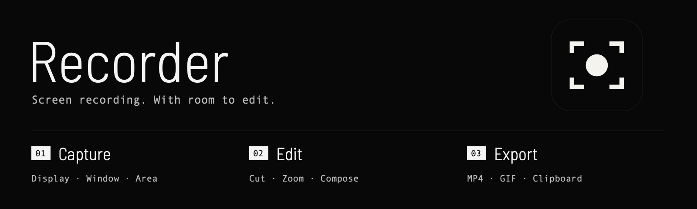
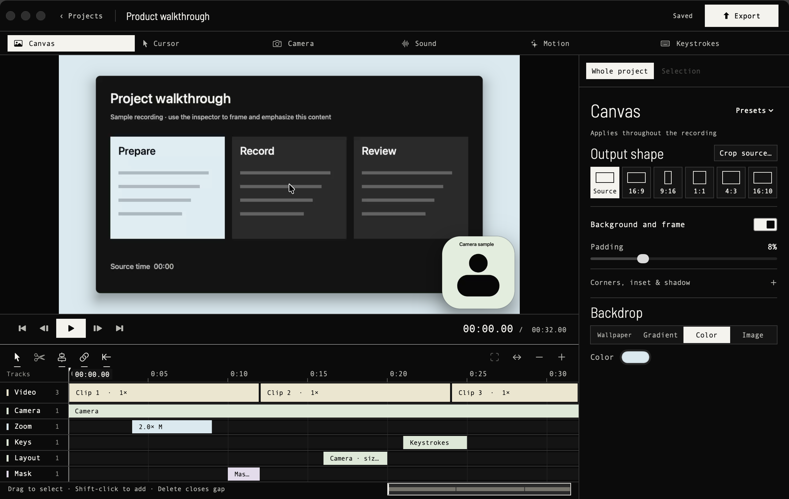
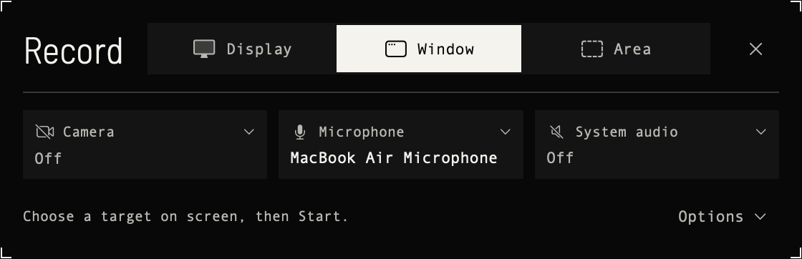

<p align="center">
  
</p>

<p align="center">
  Native macOS screen recording and non-destructive editing.<br>
  macOS 15+ · Apple Silicon &amp; Intel · Open source
</p>

<p align="center">
  <a href="https://github.com/OlegHQ/recorder/releases/latest"><strong>Download for macOS</strong></a>
  &nbsp;·&nbsp; <a href="#installation">Installation</a>
  &nbsp;·&nbsp; <a href="#build-from-source">Build from source</a>
  &nbsp;·&nbsp; <a href="https://github.com/OlegHQ/recorder/issues">Report an issue</a>
</p>


## From screen to finished clip

Record a display, a window, or an area. Keep the original media, then shape the
result with cuts, zooms, camera placement, cursor effects and keystroke overlays.



*The actual app, shown with generated demo media.*

- **Capture what matters.** Display, window and area recording, with optional camera,
  microphone and system audio.
- **Edit without losing the original.** Trim and split clips, adjust speed, arrange
  independent tracks, and undo changes.
- **Direct attention.** Automatic and manual zooms, cursor styling, masks,
  camera layouts, backgrounds and keystroke overlays.
- **Share the result.** H.264 or HEVC MP4, animated GIF, and exported-file clipboard
  handoff. The current color pipeline is SDR sRGB; HDR brightness and colors outside
  sRGB are not preserved.

<p align="center">
  
</p>

## Installation

1. Download `Recorder-<version>-universal.dmg` from the
   [latest release](https://github.com/OlegHQ/recorder/releases/latest).
2. Open the DMG and drag **Recorder** into **Applications**.
3. Eject the DMG. Open **Recorder from Applications**.
4. Approve the macOS permissions described below.

The same DMG supports Apple Silicon and Intel Macs running **macOS 15 or later**.
To update, quit Recorder and replace the app in Applications with the new version.
Your recordings are stored separately, by default in `~/Movies/Recorder`.

### First launch: Gatekeeper / “Open Anyway”

Current public builds are **ad-hoc signed and not notarized by Apple**. macOS may
block the first launch with an unidentified-developer or “Apple could not verify” message.

After attempting to open the installed app:

1. Open **System Settings → Privacy & Security**.
2. Scroll to the security message about Recorder and choose **Open Anyway**.
3. Authenticate if asked, then confirm **Open**.

Use this exception only for the Recorder build you intentionally downloaded from
this repository. See [Apple’s explanation of Gatekeeper](https://support.apple.com/en-us/102445).
No global Gatekeeper change is needed. Signing and notarization support exists in the
release workflow, but requires Apple Developer credentials; see [releasing](docs/RELEASING.md).

### Capture permissions

Recorder needs these entries enabled in **System Settings → Privacy & Security**:

| Permission | Purpose |
| --- | --- |
| Screen & System Audio Recording | Capture the selected screen content and optional system audio. |
| Accessibility | Preserve pointer and shortcut activity and support window controls. |
| Camera / Microphone | Requested when you enable those inputs. |

Return to Recorder and select **Check again**. This is a read-only check, not another
permission request. If access is still missing, use **Relaunch** after enabling it:
macOS can retain the denied state in the old process. Apple also documents
[screen and system audio permissions](https://support.apple.com/guide/mac-help/mchld6aa7d23/mac).

**Already enabled, but Recorder still says access is missing?** Ad-hoc updates can
leave a permission entry associated with an older copy of the app:

1. Quit other running copies of Recorder. Check the path/version shown in setup.
2. In builds with **Repair access…**, choose it and confirm **Reset and Relaunch**.
   This resets only Recorder’s Screen Recording and Accessibility grants, not other
   apps or recordings. Then use **Allow…**, enable access, and relaunch once more.
3. On older builds, quit Recorder, remove its entry with **−** from both permission
   lists, add `/Applications/Recorder.app` with **+**, and enable it before reopening.

If an old grant still cannot be replaced, quit every Recorder process and run these
targeted commands in Terminal, then open the installed app and grant access again:

```sh
tccutil reset ScreenCapture sh.nexo.recorder
tccutil reset Accessibility sh.nexo.recorder
```

These revoke Recorder’s two grants only. Do not use `tccutil reset All`.
Ad-hoc builds do not have a stable signing identity across updates, so recovery may
be needed again after replacing the app. Developer ID signing is needed for stable
public-release identity; repeated permission checks cannot repair that mismatch.

Avoid launching a second copy from the DMG or a build folder while troubleshooting.

## Troubleshooting

- **MP4 or GIF export crashes on 0.1.0 / 0.1.1:** update to **0.1.2 or later**.
  Those builds contain a Metal command-completion bug affecting both formats.
- **Capture looks washed out:** 0.1.2 makes capture color settings explicit and honors
  source color metadata during rendering. Color information already lost or incorrectly
  tagged in an older recording cannot always be recovered; compare a fresh recording.
- **Copy to clipboard:** copies the exported file for pasting into apps that accept
  files. It does not put a playable video into a plain-text field.
- **Still stuck:** use **Recorder → Copy State Snapshot**, then
  [open an issue](https://github.com/OlegHQ/recorder/issues) with your app/macOS versions,
  the failing action and any relevant crash report. Review snapshot contents before
  attaching them; snapshots can include images of Recorder’s windows.

## Build from source

Install Apple’s Command Line Tools (`xcode-select --install`) and use Swift 6 or later:

```sh
git clone https://github.com/OlegHQ/recorder.git
cd recorder
make app
open build/Recorder.app
```

There are no third-party Swift package dependencies. For repeated local installs,
`make cert` creates a local **Recorder Dev** signing identity so permission grants
can survive rebuilds; it does not notarize the app. `make install` installs the build
in Applications and replaces an existing Recorder app.

### Verify changes

```sh
make test
make app
build/Recorder.app/Contents/MacOS/Recorder --selftest export-colors
build/Recorder.app/Contents/MacOS/Recorder --selftest export-sheet
```

The export checks use the actual GPU and codecs: color conversion, H.264, HEVC,
animated GIF, clipboard handoff, cancellation and retry. They require a Metal-capable
Mac. Add `--capture` to `export-colors` to test a real ScreenCaptureKit capture of a
generated test window; that check requires Screen Recording permission.

See the [product specification](docs/SPEC.md), [UI direction](docs/UI-KIT.md),
and [release instructions](docs/RELEASING.md) for more detail.

## Credits

Created by [Oleg Pustovit](https://github.com/OlegHQ). Source code is
[MIT licensed](LICENSE). Bundled font and asset notices are in
[Third-party notices](Resources/THIRD_PARTY_NOTICES.md).
